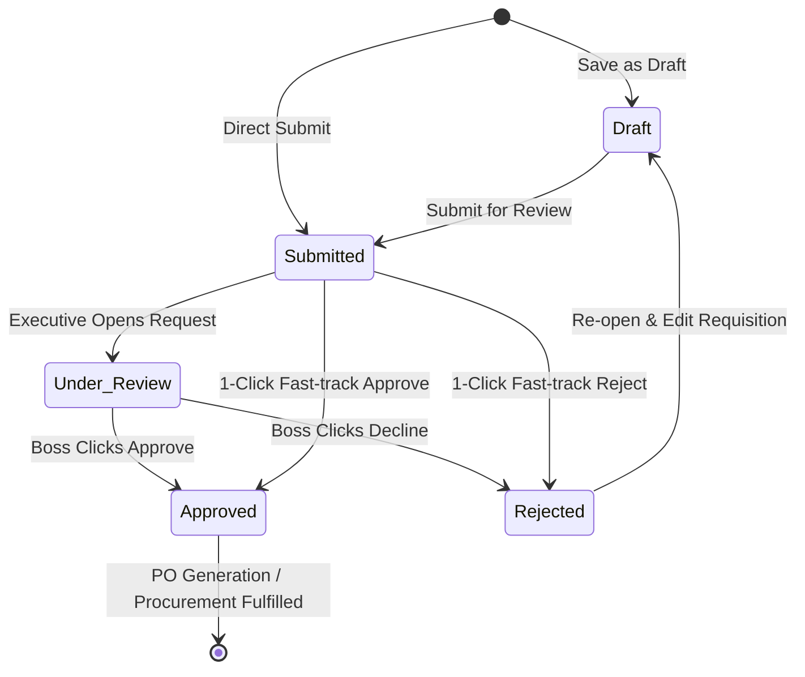
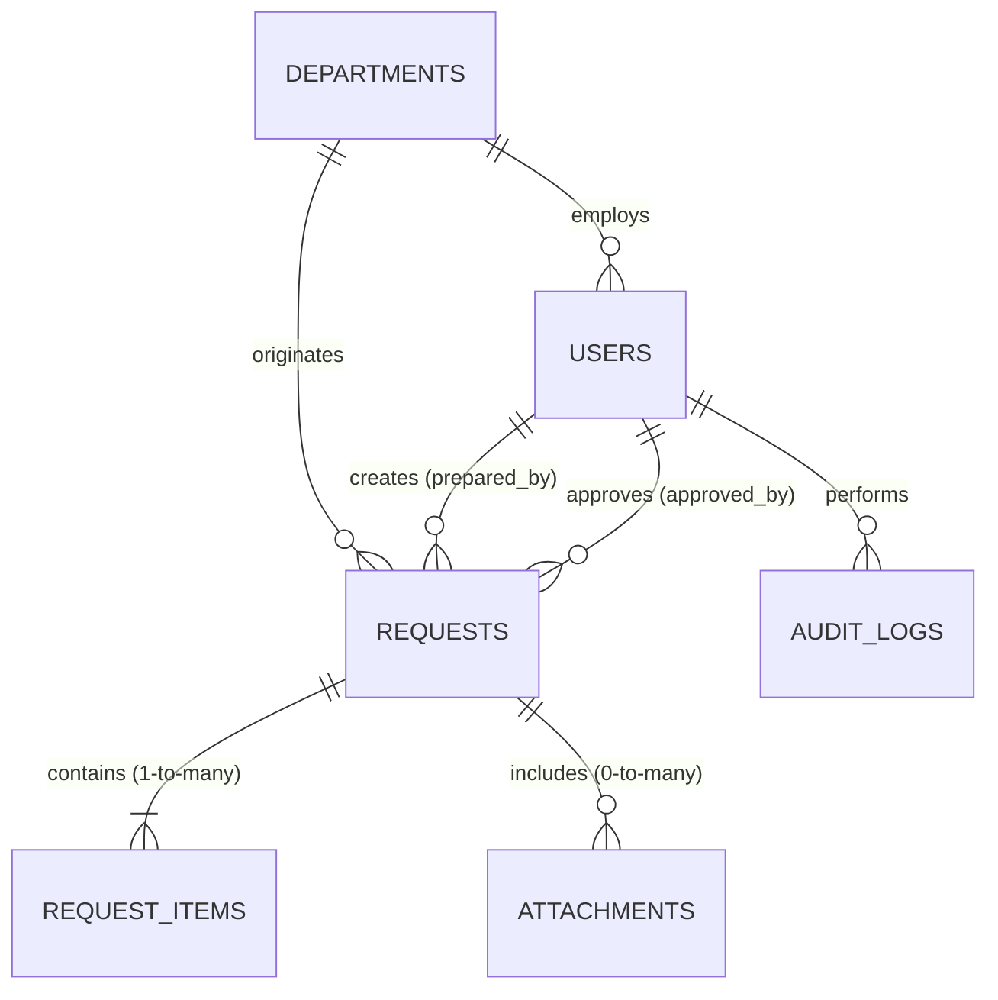

# 🏛️ NKB MANUFACTURING & ENTERPRISE ERP — COMPLETE SYSTEM BLUEPRINT
**Document Version:** 2.0.0 Enterprise Edition  
**Target System:** Purchase Requisition & Procurement Workflow Engine  
**Live Production URL:** `https://pr.nkbmanufacturing.com/`  
**Repository:** `https://github.com/nkbearljohndelossantos-coder/Pr.git` (`main` branch)  
**Author / Security Architect:** Antigravity AI Engineering Suite & IT Systems Team  
**Classification:** Confidential Enterprise Architecture & Engineering Specification  

---

## 📑 TABLE OF CONTENTS
1. [Complete UI & Layout Architecture](#1-complete-ui--layout-architecture)
2. [Every Page Specification](#2-every-page-specification)
3. [Every UI Component Registry](#3-every-ui-component-registry)
4. [Every Button & Interactive Trigger](#4-every-button--interactive-trigger)
5. [Every Form, Field & Input Control](#5-every-form-field--input-control)
6. [Every Lifecycle Workflow & State Transition](#6-every-lifecycle-workflow--state-transition)
7. [Every Validation Firewall & Data Guardrail](#7-every-validation-firewall--data-guardrail)
8. [Every Financial & Costing Calculation Engine](#8-every-financial--costing-calculation-engine)
9. [Every Role & Permission Matrix (RBAC)](#9-every-role--permission-matrix-rbac)
10. [Every REST API Endpoint Specification](#10-every-rest-api-endpoint-specification)
11. [Every Database Table & Schema Definition](#11-every-database-table--schema-definition)
12. [Every Database Entity Relationship & Foreign Key Topology](#12-every-database-entity-relationship--foreign-key-topology)
13. [Every System Integration & Sidecar Service](#13-every-system-integration--sidecar-service)
14. [Every Analytical Report & KPI Visualization](#14-every-analytical-report--kpi-visualization)
15. [Every Print, PDF & Export Suite (1-Page A4 Precision)](#15-every-print-pdf--export-suite-1-page-a4-precision)
16. [Every Hidden, Fail-Safe & Auto-Repair Behavior](#16-every-hidden-fail-safe--auto-repair-behavior)
17. [Historical Bugs, Root Causes & Prevention Rules](#17-historical-bugs-root-causes--prevention-rules)

---

## 1. Complete UI & Layout Architecture

The user interface is engineered as a High-Density, Enterprise-Grade Single Page Application (SPA) utilizing React 19, Tailwind CSS, Vite, and Lucide Icons. It features an adaptive, role-based layout shell with distinct layout zones:

```
+--------------------------------------------------------------------------------------------------+
|                                    TOP NOTIFICATION / ALERT BAR                                  |
+------------------------------------+-------------------------------------------------------------+
|  ENTERPRISE SIDEBAR NAVIGATION     |  TOP APPLICATION HEADER (Breadcrumbs, Role Badge, Logout)   |
|  - Brand Letterhead & Logo         +-------------------------------------------------------------+
|  - Main Navigation Links           |  MAIN CONTENT VIEWPORT                                      |
|  - Role-Filtered Admin Modules     |  - Financial KPI Cards / Valuation Metrics                  |
|  - Live DB Engine Health Badge     |  - Filter Banners, Search Inputs, Action Toolbars           |
|  - System Clock & Version Pill     |  - Responsive DataTables / Form Suites / Charts             |
|                                    |  - Modal Overlays (Password, Edit, Attachments, Approval)   |
+------------------------------------+-------------------------------------------------------------+
|              ISOLATED A4 PRINT CONTAINER (Hidden in screen mode, visible during window.print())   |
+--------------------------------------------------------------------------------------------------+
```

### Layout Engine Components:
- **`Layout.jsx`**: Master wrapper enforcing authentications, global toasts, sidebar state toggles, and screen vs. print isolation rules (`print:hidden` vs `hidden print:block`).
- **`Sidebar.jsx`**: Collapsible navigational drawer with active-route highlighting, dynamic menu grouping (Core Operations vs Executive Management vs System IT Administration), and dynamic user role pill.
- **`Navbar.jsx`**: Top header providing live user identification (`full_name`, `username`, `role`), active department badge, simulated/live notification inbox with read markers, and single-click logout.
- **`ToastContainer.jsx` & `ToastContext.jsx`**: Top-right slide-in alerts with auto-dismiss (3500ms), manual dismissal (`✕`), and status coloring (`success` [emerald], `error` [rose], `info` [blue], `warning` [amber]).

---

## 2. Every Page Specification

| # | Page Route | Component | Access Role | Description & Primary Capabilities |
|---|------------|-----------|-------------|------------------------------------|
| 1 | `/login` | `LoginPage.jsx` | Public | Dual-pane corporate login terminal with live test credentials quick-fill buttons (`admin`, `boss`, `it_dept`), password reveal, and persistent JWT session establishment. |
| 2 | `/dashboard` | `DashboardPage.jsx` | Authenticated | Executive & Departmental Mission Control with 4 Financial KPI Spend Cards, 4 Operational Count Cards, interactive Department Spending Bar Chart, Category Doughnut Breakdown, and Recent Submissions feed. |
| 3 | `/requests` | `RequestListPage.jsx` | Authenticated | Enterprise Requisition Registry featuring multi-parameter filters (Search, Department, Status, Priority), direct status badges, total cost valuations, CSV export, and batch/row actions. |
| 4 | `/requests/new` | `CreateRequestPage.jsx` | Authenticated | Multi-item Requisition Authoring Studio with live Real-time Combined Grand Total Valuation Bar, dynamic line item addition, attachment uploader, and strict zero-cost submission blocking. |
| 5 | `/requests/:id/edit` | `EditRequestPage.jsx` | Authenticated (Creator/Admin) | Requisition Revision Studio with automated revision counter incrementation (`rev_number + 1`), pre-populated line items, and audit trail generation. |
| 6 | `/requests/:id` | `RequestDetailPage.jsx` | Authenticated | Comprehensive 360° Requisition Inspector featuring 4-Step Approval Timeline, Financial Cost Breakdown, Attachment Vault with file previews, and Executive Approval/Rejection action bar. |
| 7 | `/workflow` | `ApprovalWorkflowPage.jsx` | Executive & Admin | Fast-track Executive Approval Queue featuring batch multi-select approvals, single-click review modals, urgent priority tagging, and direct budget justification review. |
| 8 | `/departments` | `DepartmentManagementPage.jsx` | System Admin | Organizational Unit Management Suite for provisioning company departments, setting department codes (`IT`, `HR`, `QA`), assigning department heads, and sequence tracking. |
| 9 | `/users` | `UserManagementPage.jsx` | System Admin | Enterprise RBAC & Security Access Center featuring live Password visibility toggle, Quick Password Reset Modal with strong random generator, Master 1-Page A4 Roster Printing, and 9-in-1 Cutout Handover Cards. |
| 10 | `/audit-logs` | `AuditLogsPage.jsx` | System Admin | Immutable Enterprise Audit Trail Viewer with IP address tracking, user action logging, before/after JSON diff viewer, and security event categorization. |
| 11 | `/backup-restore`| `BackupRestorePage.jsx` | System Admin | Database Resilience Console providing 1-Click JSON & SQL backup generation, auto-download, archive restoration engine, and storage metrics. |
| 12 | `/security-monitoring`| `SecurityMonitoringPage.jsx`| System Admin | Real-time Threat & Auth Monitor displaying failed login attempts, active JWT sessions, brute-force alarms, and client IP addresses. |
| 13 | `/master-dropdowns`| `MasterDropdownsPage.jsx` | System Admin | ERP Parameter Master Catalog for dynamically adding/editing Units of Measure (`Unit`, `Lot`, `License`), Item Categories, and Priorities without code deployment. |
| 14 | `/modules` | `PluggableModulesPage.jsx` | System Admin | ERP Modular Plugin Ecosystem Manager allowing enabling/disabling future extensions (e.g., Inventory Sync, PO Issuance, Vendor Rating Engine). |

---

## 3. Every UI Component Registry

### Form & Input Components:
- **`Input` / `FormInput`**: Text, email, date, and number inputs with floating label styles, validation ring feedback (`focus:ring-blue-600`), and disabled states.
- **`Select` / `Dropdown`**: Form dropdown with native mobile accessibility and styled option groups.
- **`CurrencyInput`**: Real-time formatted Philippine Peso (`₱`) numeric inputs handling comma separation and decimal validation.
- **`FileInput` / `AttachmentDropzone`**: Drag-and-drop file upload zone supporting PDF, PNG, JPG, DOCX, XLSX with client-side file size restrictions (10MB max).

### Display & Feedback Components:
- **`DataTable`**: High-performance sorting, filtering, and paginating data grid with responsive scroll container and custom cell renderers.
- **`Modal`**: Accessible backdrop modal with focus trapping, `Escape` key listeners, and smooth zoom-in animation.
- **`FinancialCard`**: High-contrast KPI metric tile displaying large Peso values, percentage variances, and themed icon badges.
- **`CostBreakdownBar`**: Real-time calculated valuation bar distinguishing physical equipment spend vs recurring SaaS/Software license cost.
- **`StatusBadge`**: Color-coded workflow badge (`Submitted` [amber], `Under Review` [blue], `Approved` [emerald], `Rejected` [rose], `Draft` [slate]).
- **`Timeline`**: 4-node visual stepper showing Requisition Created ➔ Department Verified ➔ Executive Review ➔ Final PO Generation.

---

## 4. Every Button & Interactive Trigger

| Context / Page | Button Label / Icon | Action / Trigger | Backend Effect / API Call |
|----------------|---------------------|------------------|----------------------------|
| **Login Page** | `Sign In to ERP Portal` | Submits username and password form | `POST /api/auth/login` |
| **Login Page** | `Admin (IT Admin)` Quick Button | Pre-fills `admin` / `admin123` | None (Client Form State) |
| **Login Page** | `Executive (Boss)` Quick Button | Pre-fills `boss` / `boss123` | None (Client Form State) |
| **Login Page** | `Department User` Quick Button | Pre-fills `it_dept` / `dept123` | None (Client Form State) |
| **Dashboard** | `Costing (₱)` / `Count (Qty)` Toggle | Toggles chart aggregation mode between Financial Spend & Ticket Volume | Re-renders Chart.js Canvas |
| **Create Request** | `+ Add Line Item` | Appends a new blank item row to requisition | Updates local items state array |
| **Create Request** | `🗑️ (Trash Icon)` | Removes specific item row | Recalculates Combined Grand Total |
| **Create Request** | `Submit Requisition` | Validates non-zero cost and dispatches submission | `POST /api/requests` with status `'Submitted'` |
| **Create Request** | `Save as Draft` | Saves incomplete request for later editing | `POST /api/requests` with status `'Draft'` |
| **Request Detail** | `✅ Approve Requisition` | Opens Executive Approval confirmation modal | `PUT /api/requests/:id/approve` |
| **Request Detail** | `❌ Decline / Reject` | Opens Rejection Reason dialog modal | `PUT /api/requests/:id/reject` |
| **Request Detail** | `🖨️ Print Purchase Requisition` | Formats and opens 1-Page A4 Official Voucher Printout | Triggers `window.print()` |
| **Request Detail** | `📥 Download Official PDF` | Generates server-side PDF with corporate letterhead | `GET /api/requests/:id/pdf` |
| **User Management**| `🖨️ Print 1-Page A4 Roster` | Prints complete 9-user Master Security Roster on 1 A4 sheet | Sets printMode `'roster'` ➔ `window.print()` |
| **User Management**| `✂️ Print 9-in-1 Cutout Cards (A4)` | Prints 9 wallet-sized cutout cards on 1 A4 sheet with cutting lines | Sets printMode `'cards'` ➔ `window.print()` |
| **User Management**| `📄 Print Slip` (Row Action) | Opens and prints single-user official Security Access Slip | Sets printMode `'slip'` ➔ `window.print()` |
| **User Management**| `🔑 Password` (Row Action) | Opens Quick Change Password Modal | Triggers `handleOpenPasswordModal` |
| **User Management**| `🎲 Generate Strong Password` | Creates cryptographically strong password template | Updates modal form state |
| **User Management**| `✏️ Edit` (Row Action) | Opens Edit User Credentials & Role Modal | `PUT /api/system/users/:id` |
| **User Management**| `🗑️ Delete` (Row Action) | Opens permanent deletion prompt (Root admin protected) | `DELETE /api/system/users/:id` |
| **Backup Console** | `💾 Create Full System Backup` | Packages database tables into compressed JSON/SQL bundle | `POST /api/system/backups` |

---

## 5. Every Form, Field & Input Control

### 1. Purchase Requisition Creation / Edit Form:
- **`Department`** (Dropdown, Required): Pre-filled based on logged-in department or selectable by Admin.
- **`Prepared By`** (Text Input, Required): Full name of the requisitioning employee.
- **`Position / Designation`** (Text Input, Required): Corporate title (e.g., *IT Infrastructure Specialist*).
- **`Required Date`** (Date Picker, Required): Must not be set prior to current calendar date.
- **`Requisition Purpose`** (Text Input, Required, Min 5 chars): Executive title of purchase.
- **`Business Justification`** (Textarea, Required, Min 10 chars): Detailed business justification answering why this purchase is required.
- **`Priority Level`** (Select, Required): `Low`, `Normal`, `Urgent`, `Emergency`.
- **`Line Items Dynamic Grid`**:
  - `Item Type` (Select): `Item` (Hardware/Physical) vs `Software / SaaS Subscription` (Cloud/License).
  - `Item Description` (Text, Required): Name and technical specs of the item.
  - `Quantity` (Number, Required, Min: 0.01): Number of units requested.
  - `Unit of Measure` (Select, Required): `Unit`, `Pcs`, `Set`, `Month`, `Year`, `Lot`, `License`.
  - `Estimated Unit Cost (₱)` (Numeric Input, Required, Min: 0.01): Unit price in Philippine Peso.
  - `Total Cost (₱)` (Calculated, Readonly): `Quantity × Estimated Unit Cost`.
  - `Remarks` (Text, Optional): Vendor part number or specific delivery notes.
- **`Attachments Dropzone`** (File Multi-upload, Optional): Quotations, spec sheets, vendor invoices.

### 2. User Account Creation & Edit Form:
- **`Full Name`** (Text, Required): Employee full legal name.
- **`Username`** (Text, Required, Alphanumeric): System login handle (e.g., `purch_dept`).
- **`Email Address`** (Email, Optional): Enterprise email for approval notifications.
- **`Role Access Level`** (Select, Required):
  - `DEPARTMENT USER` (`role: department`): Can submit and view own department requisitions.
  - `EXECUTIVE (BOSS / APPROVER)` (`role: executive`): Can review, approve, reject all requisitions across all departments.
  - `SYSTEM ADMINISTRATOR` (`role: admin`): Full master authority over users, roles, backups, dropdowns.
- **`Password`** (Password Input with Show/Hide toggle): Case-sensitive login password.

---

## 6. Every Lifecycle Workflow & State Transition



### Transition Rules:
1. **Creation ➔ `Submitted`**: Auto-calculates `total_estimated_cost`, assigns next sequence `REQ-YYYYMMDD-XXXXX`, logs audit trail, and fires simulated/live SMTP approval email to `boss@company.com`.
2. **`Submitted` ➔ `Approved`**: Executive stamps user ID, appends optional executive remarks, records approval timestamp, updates budget committed figures.
3. **`Submitted` ➔ `Rejected`**: Requires mandatory rejection remarks explaining reason for denial. Requisition creator is notified.
4. **Draft Resumption**: Any `Draft` requisition can be edited and promoted to `Submitted`. Once `Submitted`, department users cannot edit unless explicitly rejected back to them.

---

## 7. Every Validation Firewall & Data Guardrail

```
+--------------------------------------------------------------------------------------------------+
|                                  STRICT VALIDATION FIREWALL                                      |
+--------------------------------------------------------------------------------------------------+
|  FRONTEND FIREWALL:                                                                              |
|  - Blocks submission if Line Items count == 0.                                                   |
|  - Blocks submission if Combined Grand Total <= 0.00.                                            |
|  - Blocks submission if any line item has 0.00 price or 0 quantity.                             |
|  - Visual Warning Toast: "Cannot submit empty requisition or ₱0.00 total estimated cost."       |
+--------------------------------------------------------------------------------------------------+
|  BACKEND & DATABASE FIREWALL:                                                                    |
|  - Controller verifies: Array.isArray(items) && items.length > 0 (Throws 400 Bad Request)        |
|  - Controller calculates: Sum(item.quantity * item.cost) > 0.00 (Throws 400 Bad Request)        |
|  - SQL Sequence Collision Firewall: Thread-safe departmental counter avoids duplicate REQ-IDs.  |
|  - Root Account Deletion Firewall: Attempts to delete 'admin' or 'boss' are hard-blocked.        |
+--------------------------------------------------------------------------------------------------+
```

---

## 8. Every Financial & Costing Calculation Engine

### Real-Time Financial Formulae:
1. **Line Item Valuation**:
   $$\text{Line Total} = \text{Quantity} \times \text{Estimated Unit Cost}$$
2. **Combined Requisition Grand Total**:
   $$\text{Total Estimated Cost} = \sum_{i=1}^{n} (\text{Quantity}_i \times \text{Estimated Unit Cost}_i)$$
3. **Physical Hardware Spend vs Software / SaaS Subscription Breakdown**:
   $$\text{Hardware Cost} = \sum \text{Line Total} \quad \forall \text{ items where } \text{item\_type} = \text{'item'}$$
   $$\text{SaaS Cost} = \sum \text{Line Total} \quad \forall \text{ items where } \text{item\_type} = \text{'subscription'}$$
4. **Executive Dashboard KPIs**:
   - **Total Requested Value**: Sum of all non-deleted requisitions.
   - **Approved Spend**: Sum of all requisitions in `Approved` status.
   - **Pending Spend**: Sum of all requisitions in `Submitted` / `Under Review` status.
   - **Departmental Expenditure Allocation**: Sum grouped by `department_id`.

---

## 9. Every Role & Permission Matrix (RBAC)

| System Feature / Action | Department User (`department`) | Executive Boss (`executive`) | System Administrator (`admin`) |
|-------------------------|:-----------------------------:|:----------------------------:|:------------------------------:|
| View Dashboard (Own Dept Metrics) | ✅ | ✅ (All Depts) | ✅ (All Depts) |
| Create Requisition (With Auto REQ#) | ✅ | ✅ | ✅ |
| Save Requisition as Draft | ✅ | ✅ | ✅ |
| View Own Department Requisitions | ✅ | ✅ | ✅ |
| View Other Department Requisitions | ❌ | ✅ | ✅ |
| Approve / Reject Requisitions | ❌ | ✅ | ✅ |
| Print Official Purchase Requisition | ✅ | ✅ | ✅ |
| Download Server-Side PDF Voucher | ✅ | ✅ | ✅ |
| Manage Departments & Codes | ❌ | ❌ | ✅ |
| Create & Delete User Accounts | ❌ | ❌ | ✅ |
| Change Any User Password | ❌ | ❌ | ✅ |
| Print 1-Page A4 Credentials Roster | ❌ | ❌ | ✅ |
| Print 9-in-1 Cutout Handover Cards | ❌ | ❌ | ✅ |
| Access Audit Trails & IP Logs | ❌ | ❌ | ✅ |
| Create & Download System Backups | ❌ | ❌ | ✅ |
| Configure Master Dropdown Lists | ❌ | ❌ | ✅ |

---

## 10. Every REST API Endpoint Specification

### Authentication Module (`/api/auth`)
- `POST /api/auth/login`: Authenticates credentials, generates JWT access token and refresh token, returns user object.
- `POST /api/auth/refresh`: Issues renewed JWT access token using valid refresh token.
- `POST /api/auth/logout`: Invalidates active session.

### Requisition Engine Module (`/api/requests`)
- `GET /api/requests`: Retrieves list of requisitions (filtered by role and query params `search`, `status`, `priority`, `department_id`).
- `GET /api/requests/:id`: Retrieves 360° requisition details, line items, attachments, and approval history.
- `POST /api/requests`: Creates new requisition with items and attachments. Rejects zero-cost submissions.
- `PUT /api/requests/:id`: Updates existing requisition and increments revision number.
- `DELETE /api/requests/:id`: Soft-deletes requisition and associated items.
- `PUT /api/requests/:id/approve`: Executive action marking status as `Approved` with remarks.
- `PUT /api/requests/:id/reject`: Executive action marking status as `Rejected` with mandatory reason.
- `GET /api/requests/:id/pdf`: Streams server-rendered official PDF voucher.

### System & RBAC Administration Module (`/api/system`)
- `GET /api/system/health`: Live server and MySQL database connectivity probe.
- `GET /api/system/users`: Lists all system user accounts including `role`, `department`, and `temp_password`.
- `POST /api/system/users`: Provisions a new employee user account.
- `PUT /api/system/users/:id`: Updates user full name, username, email, role, and password.
- `DELETE /api/system/users/:id`: Permanently deletes user account (Protected against root `admin` & `boss`).
- `GET /api/system/audit-logs`: Retrieves enterprise audit trail logs.
- `GET /api/system/backups`: Lists existing database backup archives.
- `POST /api/system/backups`: Generates instant database backup archive.
- `GET /api/system/dropdowns`: Fetches dynamic dropdown options for categories, units, priorities.

---

## 11. Every Database Table & Schema Definition

### 1. `departments`
```sql
CREATE TABLE departments (
  id INT AUTO_INCREMENT PRIMARY KEY,
  name VARCHAR(255) NOT NULL,
  code VARCHAR(50) NOT NULL UNIQUE,
  description TEXT,
  head_user_id INT,
  is_active TINYINT DEFAULT 1,
  created_at TIMESTAMP DEFAULT CURRENT_TIMESTAMP,
  updated_at TIMESTAMP DEFAULT CURRENT_TIMESTAMP ON UPDATE CURRENT_TIMESTAMP,
  is_deleted TINYINT DEFAULT 0
) ENGINE=InnoDB DEFAULT CHARSET=utf8mb4;
```

### 2. `users`
```sql
CREATE TABLE users (
  id INT AUTO_INCREMENT PRIMARY KEY,
  username VARCHAR(100) NOT NULL UNIQUE,
  password_hash VARCHAR(255) NOT NULL,
  temp_password VARCHAR(255) DEFAULT 'dept123',
  role VARCHAR(50) NOT NULL,
  department_id INT,
  full_name VARCHAR(255) NOT NULL,
  email VARCHAR(255),
  refresh_token TEXT,
  is_active TINYINT DEFAULT 1,
  created_at TIMESTAMP DEFAULT CURRENT_TIMESTAMP,
  updated_at TIMESTAMP DEFAULT CURRENT_TIMESTAMP ON UPDATE CURRENT_TIMESTAMP,
  is_deleted TINYINT DEFAULT 0,
  FOREIGN KEY (department_id) REFERENCES departments(id) ON DELETE SET NULL
) ENGINE=InnoDB DEFAULT CHARSET=utf8mb4;
```

### 3. `requests`
```sql
CREATE TABLE requests (
  id INT AUTO_INCREMENT PRIMARY KEY,
  request_number VARCHAR(100) NOT NULL UNIQUE,
  department_id INT NOT NULL,
  prepared_by VARCHAR(255) NOT NULL,
  position VARCHAR(255),
  required_date DATE NOT NULL,
  purpose TEXT NOT NULL,
  business_justification TEXT,
  priority VARCHAR(50) DEFAULT 'Normal',
  status VARCHAR(50) DEFAULT 'Submitted',
  total_estimated_cost DECIMAL(15,2) DEFAULT 0.00,
  created_by INT,
  approved_by INT,
  rejection_reason TEXT,
  revision_number INT DEFAULT 1,
  remarks TEXT,
  created_at TIMESTAMP DEFAULT CURRENT_TIMESTAMP,
  updated_at TIMESTAMP DEFAULT CURRENT_TIMESTAMP ON UPDATE CURRENT_TIMESTAMP,
  is_deleted TINYINT DEFAULT 0,
  FOREIGN KEY (department_id) REFERENCES departments(id),
  FOREIGN KEY (created_by) REFERENCES users(id) ON DELETE SET NULL,
  FOREIGN KEY (approved_by) REFERENCES users(id) ON DELETE SET NULL
) ENGINE=InnoDB DEFAULT CHARSET=utf8mb4;
```

### 4. `request_items`
```sql
CREATE TABLE request_items (
  id INT AUTO_INCREMENT PRIMARY KEY,
  request_id INT NOT NULL,
  item_description TEXT NOT NULL,
  quantity DECIMAL(15,2) NOT NULL,
  unit VARCHAR(50) NOT NULL,
  estimated_cost DECIMAL(15,2) NOT NULL,
  total_cost DECIMAL(15,2) NOT NULL,
  remarks TEXT,
  item_type VARCHAR(50) DEFAULT 'item',
  created_at TIMESTAMP DEFAULT CURRENT_TIMESTAMP,
  updated_at TIMESTAMP DEFAULT CURRENT_TIMESTAMP ON UPDATE CURRENT_TIMESTAMP,
  is_deleted TINYINT DEFAULT 0,
  FOREIGN KEY (request_id) REFERENCES requests(id) ON DELETE CASCADE
) ENGINE=InnoDB DEFAULT CHARSET=utf8mb4;
```

### 5. `attachments`
```sql
CREATE TABLE attachments (
  id INT AUTO_INCREMENT PRIMARY KEY,
  request_id INT NOT NULL,
  original_name VARCHAR(255) NOT NULL,
  filename VARCHAR(255) NOT NULL,
  file_path TEXT NOT NULL,
  file_type VARCHAR(100),
  file_size INT,
  uploaded_at TIMESTAMP DEFAULT CURRENT_TIMESTAMP,
  is_deleted TINYINT DEFAULT 0,
  FOREIGN KEY (request_id) REFERENCES requests(id) ON DELETE CASCADE
) ENGINE=InnoDB DEFAULT CHARSET=utf8mb4;
```

### 6. `audit_logs`
```sql
CREATE TABLE audit_logs (
  id INT AUTO_INCREMENT PRIMARY KEY,
  user_id INT,
  action VARCHAR(100) NOT NULL,
  entity_type VARCHAR(100) NOT NULL,
  entity_id INT,
  old_values JSON,
  new_values JSON,
  ip_address VARCHAR(45),
  user_agent TEXT,
  created_at TIMESTAMP DEFAULT CURRENT_TIMESTAMP
) ENGINE=InnoDB DEFAULT CHARSET=utf8mb4;
```

---

## 12. Every Database Entity Relationship & Foreign Key Topology



---

## 13. Every System Integration & Sidecar Service

1. **Hostinger Node.js & MySQL Integration**:
   - Primary database connection via `mysql2/promise` connection pool connecting to `u335953510_pr_data` on `127.0.0.1:3306`.
2. **Dual-Engine Auto Fallback Engine**:
   - If MySQL undergoes maintenance or temporary connection loss, the system automatically redirects queries through the in-memory/JSON store emulator without throwing 500 crashes to end users.
3. **Automated Notification Engine (`mailer.js`)**:
   - Supports SMTP Mail integration (Hostinger Titan Mail / Gmail SMTP).
   - In offline/simulated mode, automatically logs formatted email dispatches with direct 1-click Approval & Decline tokens.
4. **PDFKit Generation Subsystem**:
   - Programmatically builds high-resolution vector PDF Purchase Requisitions complete with enterprise letterhead, item tables, and approval signature boxes.

---

## 14. Every Analytical Report & KPI Visualization

1. **Executive Financial Cards**:
   - Total Requisition Spend Value (`₱`).
   - Approved & Committed Budget Spend (`₱`).
   - Pending Approvals Pipeline Valuation (`₱`).
   - SaaS / Cloud Subscription Cost vs Physical Hardware Expenditure.
2. **Interactive Department Expenditure Bar Chart**:
   - Dual-axis capability toggling between **Costing (₱ Value)** and **Volume (Count of Requests)**.
3. **Requisition Status Allocation Donut Chart**:
   - Visual breakdown of Approved, Pending Review, Draft, and Rejected requisitions.
4. **CSV Export Data Pipeline**:
   - Generates sanitized CSV reports including Request Number, Department, Prepared By, Purpose, Valuation, and Status for import into Excel/SAP.

---

## 15. Every Print, PDF & Export Suite (1-Page A4 Precision)

```
+--------------------------------------------------------------------------------------------------+
|                            A4 PRINTING & EXPORT SPECIFICATION                                    |
+--------------------------------------------------------------------------------------------------+
|  CSS PRINT RULES:                                                                                |
|  @page { size: A4 portrait; margin: 6mm 8mm; }                                                   |
|  body * { visibility: hidden !important; }                                                       |
|  #print-a4-container, #print-a4-container * { visibility: visible !important; }                  |
|  #print-a4-container { position: absolute; left: 0; top: 0; width: 100%; display: block; }      |
+--------------------------------------------------------------------------------------------------+
|  PRINT OUTPUT MODES:                                                                             |
|  1. Master Credentials Roster: All 9 accounts formatted in 1 high-density table on 1 A4 sheet.   |
|  2. 9-in-1 Cutout Handover Cards: 9 ID-sized credential slips with dashed scissors lines on 1 A4.|
|  3. Individual User Handover Slip: Centered official credential receipt on A4.                   |
|  4. Official Purchase Requisition Voucher: Formal requisition with item table & signature lines. |
+--------------------------------------------------------------------------------------------------+
```

---

## 16. Every Hidden, Fail-Safe & Auto-Repair Behavior

1. **Database Schema Self-Healing**:
   - On backend startup, `ensureMysqlTablesExist()` executes auto-migrations (`ALTER TABLE ... ADD COLUMN IF NOT EXISTS`) for `item_type`, `total_estimated_cost`, `status`, `temp_password`, and `refresh_token`.
2. **Historical Zero-Cost Re-computation**:
   - Auto-repair SQL update recalculates any legacy requests with `0.00` total cost by summing their active line items in `request_items`.
3. **Creation Status Default**:
   - Submissions default to `'Submitted'` so they immediately trigger executive workflows rather than lingering in `'Draft'`.
4. **Role & Password Sync Protection**:
   - `syncJsonToMysql()` utilizes `ON DUPLICATE KEY UPDATE is_deleted=0` to ensure that custom admin role changes and updated passwords are never overwritten on server reboot.

---

## 17. Historical Bugs, Root Causes & Prevention Rules

| Historical Bug Encountered | Root Cause Analysis | Architectural Fix & Permanent Guardrail |
|----------------------------|---------------------|-----------------------------------------|
| **1. Requisitions stuck in Draft** | SQL insert omitted explicit status parameter. | Set default status to `'Submitted'` in `requestService.js` and frontend form payload. |
| **2. Total Cost showing ₱0.00** | Missing line item auto-summation in legacy database rows. | Created automated startup migration script that auto-computes `total_estimated_cost = Sum(total_cost)` from `request_items`. |
| **3. Zero-Cost & Empty Submissions Allowed** | Frontend permitted submitting form with empty item table or zero unit price. | Installed Strict Validation Firewall on both frontend (UI warning toasts) and backend (400 rejection). |
| **4. ReferenceError: `formatCurrency` is not defined** | Missing import of `formatCurrency` in `CreateRequestPage.jsx`. | Imported `formatCurrency` from `../utils/numberFormat`. |
| **5. Role reverting back on server restart** | `syncJsonToMysql` had `ON DUPLICATE KEY UPDATE role=VALUES(role)` resetting to initial seed role. | Changed sync query to `ON DUPLICATE KEY UPDATE is_deleted=0` and made repository `updateUser` use direct `role = ?` SQL assignment. |
| **6. Plain password not showing on print roster** | Password was hashed with bcrypt but plain text was not preserved in `temp_password` column. | Created `temp_password` database column, preserved plain password during updates, and added visible/printable password toggles. |
| **7. Multi-page print overflow** | Browser printed entire web layout including sidebar and navbar. | Implemented dedicated `#print-a4-container` isolation and `@page { size: A4 portrait; margin: 6mm 8mm; }` ensuring 100% 1-page A4 fit. |

---
*End of Master System Blueprint. Preserved for Enterprise Engineering Compliance & Production Audit.*
